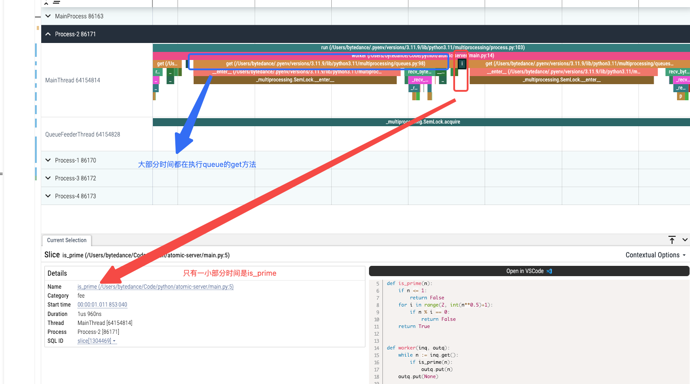

# python 中的多进程

## 例子

### 单进程代码

```python
import time
def is_prime(n):
    if n <= 1:
        return False
    for i in range(2, int(n**0.5)+1):
        if n % i == 0:
            return False
    return True

MAX_NUMBER = 100000
primes = []
start = time.time()
for i in range(1, MAX_NUMBER):
    if is_prime(i):
        primes.append(i)

print(f"Took {time.time() - start} seconds")
print(f"Got {len(primes)} prime numbers")
'''输出：
Took 0.10959100723266602 seconds
Got 9592 prime numbers
'''
```

### 多进程代码

```python
import multiprocessing
import time

def is_prime(n):
    if n <= 1:
        return False
    for i in range(2, int(n**0.5)+1):
        if n % i == 0:
            return False
    return True

def worker(inq, outq):
    while n := inq.get():
        if is_prime(n):
            outq.put(n)
    outq.put(None)

if __name__ == "__main__":
    MAX_NUMBER = 100000
    primes = []

    start = time.time()

    inq = multiprocessing.Queue()
    outq = multiprocessing.Queue()

    workers = [multiprocessing.Process(target=worker, args=(inq, outq)) for _ in range(4)]

    for w in workers:
        w.start()

    for i in range(1, MAX_NUMBER):
        inq.put(i)

    for _ in workers:
        inq.put(None)


    finish = 0
    while finish < 4:
        if n := outq.get():
            primes.append(n)
        else:
            finish += 1

    print(f"Took {time.time() - start} seconds")
    print(f"Got {len(primes)} prime numbers")
    '''输出：
    Took 1.2420778274536133 seconds
    Got 9592 prime numbers
    '''
```

> 可以看到用多进程反而更慢了

### 使用 viztracer 分析

1. vscode 中安装 viztracer
2. 右键指定文件或者`python -m viztracer  -- main.py`来生成 result.json
3. vscode 中右键 result.json 来查看结果
   
4. 大部分浪费在进程间数据传输上

### 尝试输出传输改成批量

> 因为任务分配的不均导致存在子进程结束时间不一致的问题

### 改用 python 内置的

```python
import multiprocessing
import time


def is_prime(n):
    if n <= 1:
        return False
    for i in range(2, int(n**0.5)+1):
        if n % i == 0:
            return False
    return True


def worker(inq, outq):
    while n := inq.get():
        if is_prime(n):
            outq.put(n)
    outq.put(None)

if __name__ == "__main__":
    MAX_NUMBER = 100000
    primes = []

    start = time.time()

    with multiprocessing.Pool(4) as pool:
        primes = [n+1 for
                  n, prime in enumerate(pool.map(is_prime, range(1, MAX_NUMBER)))
                  if prime
                  ]

    print(f"Took {time.time() - start} seconds")
    print(f"Got {len(primes)} prime numbers")
'''输出：
Took 0.12711286544799805 seconds
Got 9592 prime numbers
'''

> 仍然慢，有两个原因：
> 1. 进程需要一段时间来做overhead工作，即准备进程环境
> 2. 当前工作量太小，相比较来说，进程的开销就占比较多，可以把100000改成1000000再看效果
>   单进程： Took 2.6400530338287354 seconds
>   多进程： Took 0.9567408561706543 seconds
>   10000000:
>   单进程： Took 71.05320811271667 seconds
>   多进程： Took 20.97710108757019 seconds
'''
```
