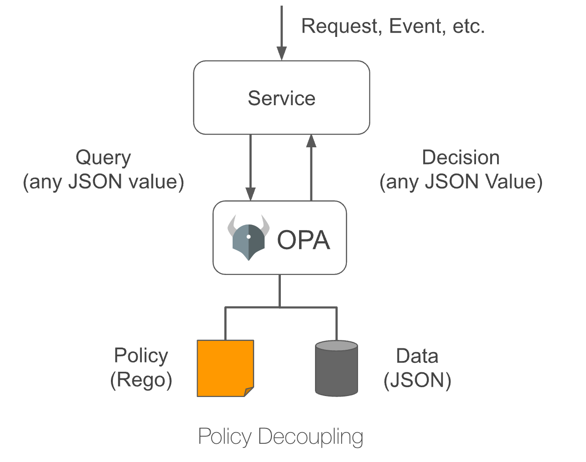

# 通用策略引擎-opa

## opa 是什么

> opa 是一套通用策略引擎，全称是 Open Policy Agent；<br>
> 通过设置一组规则，当请求发送到引擎，引擎根据规则来进行决策。


可以看到 OPA 并不负责具体任务的执行，它仅负责决策，需要决策的请求通过 JSON 的方式传递给 OPA ，在 OPA 决策后，也会将结果以 JSON 的形式返回。

> 常见使用场景：

- 需要策略控制用户是否可登陆服务器或者做一些操作；
- 需要策略控制哪些项目/哪些组件可进行部署；
- 需要策略控制如何访问数据库；
- 需要策略控制哪些资源可部署到 Kubernetes 中；

### rbac 和 abac

> 显然 opa 是 基于 pbac(abac 的一个变种)模型的实现

#### 1. rbac Role-Based Access Control 基于角色的权限控制

    核心为用角色来封装一系列权限，并通过将角色赋予用户来给用户赋予权限；

#### 2. abac/pbac

    abac 是通过动态计算一个或一组属性来判断是否满足某种条件来进行授权判断

    pbac和abac的区别是: abac 需要使用 xml 的标准，但 pbac 更加灵活 [wiki-abac]

#### 区别

例如：允许所有班主任在上课时间可进出校门；

- rabc 的实现为创建一个班主任角色，赋予班主任上课时间可进出校门的权限，再将班主任赋予用户。
- abac 中，班主任是用户属性，上课时间是环境属性，进出是操作属性，校门是对象属性；然后再 abac 的配置文件(xml、yaml、DSL-rego)中添加这样一条规则，abac 的规则解析引擎将配置解析后使用；使用者传入属性，abac 返回是否有权限。

## opa 使用

- 如果应用程序是用 Golang 写的，可以把 OPA 作为应用程序中的第三方库来实现。
- 如果不使用 Go，那么可以像其他服务一样，把 OPA 作为一个守护程序来部署
- - 推荐使用一个 sidecar 容器或在主机上运行，这样可以通过减少网络调用来提高性能和可用性

### 安装

1. 二进制

2. 容器

### 运行 OPA

> brew install opa

1. `opa eval` 直接输出结果

```shell
    opa eval "1*2+3" # 计算表达式

    opa eval -i input.json -d example.rego "data.example.violation[x]" # 给定属性和规则，查询结果
    # 输出 json

```

2. `opa run` REPL 实时交互:

3. 使用`opa run --server`启动服务器

   > opa run --server ./example.rego # 默认监听 8181

4. 作为 go 库

```go
package main

import (
	"context"
	"encoding/json"
	"fmt"
	"log"
	"os"

	"github.com/open-policy-agent/opa/rego"
)

// go run main.go sth.rego "data" < input.json
func main() {

	ctx := context.Background()

	// Construct a Rego object that can be prepared or evaluated.
	r := rego.New(
		rego.Query(os.Args[2]),               // data
		rego.Load([]string{os.Args[1]}, nil)) // sth.go

	// Create a prepared query that can be evaluated.
	query, err := r.PrepareForEval(ctx)
	if err != nil {
		log.Fatal(err)
	}

	// Load the input document from stdin.
	var input interface{}
	dec := json.NewDecoder(os.Stdin)
	dec.UseNumber()
	if err := dec.Decode(&input); err != nil {
		log.Fatal(err)
	}

	rs, err := query.Eval(ctx, rego.EvalInput(input))
	if err != nil {
		log.Fatal(err)
	}

	fmt.Println(rs)
}

/*输出
 * [{[map[example:map[allow:false public_servers:[map[id:app ports:[p1 p2 p3] protocols:[https ssh]] map[id:ci ports:[p1 p2] protocols:[http]]] violation:[busybox ci]]]] map[]}]
 */

```

5. https://play.openpolicyagent.org/

是否可以达到当前的策略效果？

> 调研的时候带几个问题：
> go lib 使用实践
> rego 策略怎么存到库里最好，如何更新。能不能多 rego，还是全局唯一，每次要全量加载来决策。
> rbac 和 abac 实现理解。可以看看https://play.openpolicyagent.org/
> 如何达到当前统一平台的策略效果：1 校验 action 动作 2 校验具体的资源是归属

# 引用

1. 官方文档 https://www.openpolicyagent.org/docs/latest/
2. https://blog.haohtml.com/archives/31514/
