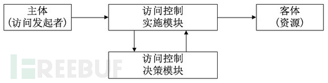
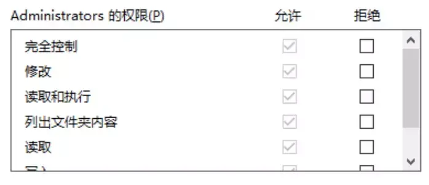

# 访问控制模型介绍

# 名词解析

| 名词 | 全称                           | 解释                                                                       |
| ---- | ------------------------------ | -------------------------------------------------------------------------- |
| iam  | Identity and Access Management | 身份和访问关系                                                             |
| dac  | Discretionary Access Control   | 自主访问控制                                                               |
| acl  | Access Control List            | 访问控制列表                                                               |
| acm  | Access Control Matrix          | 权限控制矩阵                                                               |
| mac  | Mandatory Access Control       | 强制访问控制模型                                                           |
| rbac | Role-Based Access Control      | 基于角色的权限控制；通过角色关联用户，角色关联权限的方式间接赋予用户权限。 |
| abac | Attribute-Based Access Control | 基于属性的权限控制；                                                       |
| pbac | Policy-Based Access Control    | 基于策略的权限控制；                                                       |
| cbac | Claims-Based Access Control    | 基于声明的权限控制；                                                       |

# 访问控制模型

访问控制模型三要素


- 主体(Subject) 指主动对其他实体实施动作的实体；例如用户
- 客体(Object) 指被动接受其他实体操作的实体；例如商品
- 控制策略(Policy/action) 指主客体之间的操作行为和约束条件；即为我们讨论的重点

## dac

### dac 的访问控制的实现

1. 方案 1: acl(Access Control List) 权限控制列表

每个客体都有一个列表，记录了主体对客体的可以做的操作。当主体系统操作客体时，须先检查列表中是否有权限。

```
例如：
    一个文件对象的acl：
    - Alice: read, write
    - Bob: read
    表示Alice可以对该文件进行读写，Bob只能读取
```

2. 方案 2: acm(Access Control Matrix) 访问控制矩阵
   矩阵形式描述主体和客体之间的权限分配关系。每个主体而言，都拥有对哪些客体的哪些访问权限；而对客体而言，又有哪些主体对他可以实施访问；

### 使用场景

常用于文件系统的权限设计；

微软的 ntfs 就是典型的 dac


### 总结

1. 特点：主体/客体可以自主的赋予或回收权限。
2. 缺点：
   - 不够灵活
   - 在主客体较多时，acl 就会很大，较难维护

## mac

为了弥补 DAC 权限控制过于分散的问题而诞生。<br>
在计算机安全领域指一种由操作系统约束的访问控制，目标是限制主题或发起者访问或对对象或目标执行某种操作的能力。<br>
任何主体对任何对象的任何操作都将根据一组授权规则(也成为策略)进行测试，决定操作是否允许。

- Subject 被赋予一定的安全级别
- Object 被赋予一定的安全级别
- Subject 能否访问 Object 由双方的关系安全级别决定，这个判断通常有系统硬性限制

例如

- 用户的安全级别是机密人员；文件的安全级别也是机密级别；则用户可以访问文件。
- 用户的安全级别是机密人员；文件的安全级别也是绝密级别；则用户不可以访问文件。

使用场景

- 缺点

## rabc

1. rabc0

   核心为用角色来封装一系列权限，并通过将角色赋予用户来给用户赋予权限；

   这样在判断用户的权限实现时：通过角色来获取到所具有的权限，来实现是否有权限。

2. rabc1

   增加子角色的分层，子角色可以继承父角色的所有权限。

   这种设计可以给角色分组和分层，一定程度上简化了权限管理工作。

3. rabc2

   增加职责分离的 rabc

   - 例如：篮球运动员角色同时拥有裁判的权限，显然是不应该的

   职责分离有两种模式：

   - 静态职责分离(static Separation of Duty)：用户无法同时被赋予有冲突的角色
   - 动态职责分离(Dynamic Separation of Duty)：用户在一次会话(Session)中不能同时激活自身所拥有的、互相有冲突的角色，只能选择其一。
     - 例如：只能以管理员登录或者以普通用户登录的场景

4. rabc3

   - 同时包含 1 和 2 的特性

### 总结

1. 优点
   - 有很好的扩展性
   - 整体理解比较简单，使用成本低
2. 缺点
   - 角色爆炸
   - 静态模型：没有环境、对象属性等动态属性参与；如下 case 不能实现
   - - 当一个文档的所属部门跟用户的部门相同时，用户可以访问这个文档；
   - - 当用户是一个文档的拥有者并且文档的状态是草稿，用户可以编辑这个文档；
   - - 早上九点前禁止 A 部门的人访问 B 系统；
   - - 在除了上海以外的地方禁止以管理员身份访问 A 系统；

## abac

### 介绍

abac 是通过动态计算一个或一组属性来判断是否满足某种条件来进行授权判断；

属性通常来说分 4 类：

1. `对象属性(如：用户的年龄，地址，角色，部门，ID等)`
2. `资源属性(如：一篇文章，数据，服务器，api等；其属性包括文件的创建日志等)`
3. `操作属性(如：c u r d copy) `
4. `环境属性(如：当前时间)`

在 rabc 的主体

```
    使用者  --一组属性--> abac : 判断
    使用者  <--有无权限-- abac : 返回

    每当使用者发生请求时，abac都会分析属性值是否与已建立的策略匹配，如果匹配，则会通过。
```

### 例子

1. 对于：允许所有班主任在上课时间可进出校门；

   rabc 的实现为创建一个班主任角色，赋予班主任上课时间可进出校门的权限，再将班主任赋予用户。

   abac 中，班主任是用户属性，上课时间是环境属性，进出是操作属性，校门是对象属性；然后再 abac 的配置文件(xml、yaml、DSL-rego)中添加这样一条规则，abac 的规则解析引擎将配置解析后使用；使用者传入属性，abac 返回是否有权限。

2. 张三作为销售部门的写手，可以在 2022-01-01 到 2022-12-31 期间，对归属于科技，软件的草案和文档进行创建和更新.

```xml
Subject:
    Name: 张三
    Department: 销售
    Role: Writer
Action:
    - create
    - update
Resource:
    Type: Article
    Tag:
        - technology
        - software
    Mode:
        - draft
Contextual: //
    Location: 上海
    StartTime: 2022-01-01
    EndTime: 2022-12-31
```

### 总结

#### 优点

- 不需要预定义判断逻辑，减轻了权限系统的维护成本
- 定义权限时，不能直接看出用户和对象间的关系

#### 缺点

- 相对复杂，对于用户来说有使用和理解的成本：不能直接看出用户和对象间的关系
- 规则如果稍微复杂一点，或者设计混乱，会给管理的维护和追查带来麻烦
- 权限判断需要实时执行，规则过多会导致性能出现问题
- abac 在创建和编辑属性时，依赖于 xacml
- - 实现 ABAC 的主要标准是 XACML 和 ALFA (XACML)

#### pabc

基于策略的权限模型（Policy Based Access Control），属于 abac 的变种；和 abac 的区别为，abac 需要使用 xml 的标准，但 pbac 更加灵活 [wiki-abac](https://en.wikipedia.org/wiki/Attribute-based_access_control)

策略（Policy）由实体（Entity）三元组和条件（Condition）组成<br>
实体三元组分别为资源(Object/Resource)，操作(Action/Role)，身份(Principal/Identity)。

> 一条策略可这样表示
>
> > Identity A Has Role B On Resource C In D Condition
>
> 上述概念即表示为：在某种条件下，某个身份对于某个资源有某个操作/角色。

其实看起来是跟 abac 一致的

#### cabc

这是微软在 ABAC 基础的改版协议，具体可以查阅[这里](https://learn.microsoft.com/en-us/openspecs/windows_protocols/ms-azod/e600249e-247b-469c-8979-e0c578adfbe6)

# 总结

各种访问控制模型不是独立的，在实际场景中通常结合使用

例如：系统中可以用不同身份登录，这是 rabc；同时

# 参考

1. rabc 介绍 https://www.woshipm.com/pd/1722747.html
2. 浅析权限管理模型(DAC, MAC, RBAC, ABAC) https://juejin.cn/post/6844904056876433416
3. 权限系统实现方案 https://piggsoft.com/2022/03/26/%E6%AF%8F%E5%91%A8%E7%9F%A5%E8%AF%86%E7%82%B9%E4%BB%8B%E7%BB%8D-%E6%9D%83%E9%99%90%E7%B3%BB%E7%BB%9F%E5%AE%9E%E7%8E%B0%E6%96%B9%E6%A1%88/
